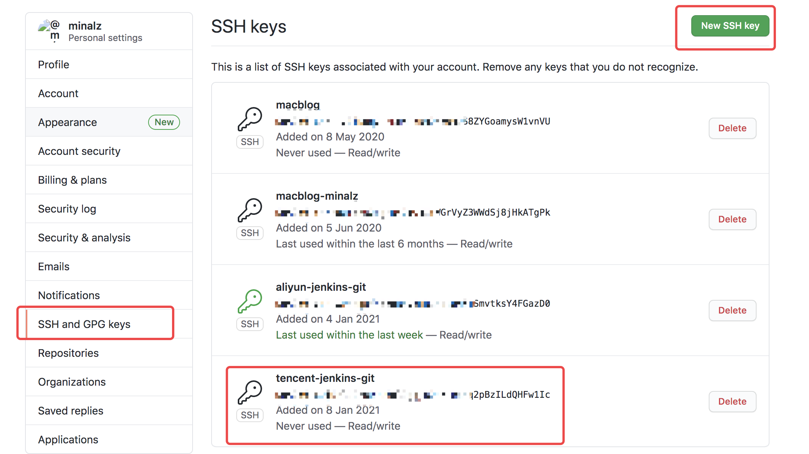
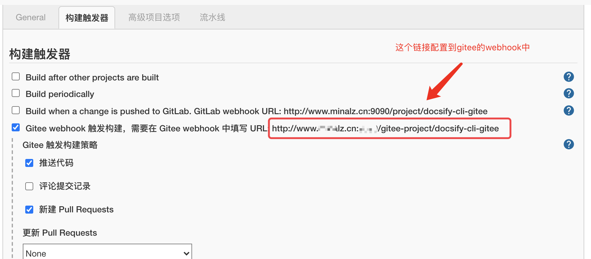

# Docker + Docsify + jenkins搭建CICD的步骤(Gitee版本)

注:由于国内访问Github太慢了,导致webhook也经常超时,经常触发不了,所以改成了Gitee,速度超快

前面的准备都是一样的,主要是jenkins和Gitee的配置

## 1.需要安装java环境

下载jdk然后安装,配置环境变量即可

```shell
vi /etc/profile
export JAVA_HOME=/usr/local/java8/jdk1.8.0_181
export PATH=$PATH:$JAVA_HOME/bin
source /etc/profile
验证:
java -version
```


## 2.安装git

```shell
yum install git
验证:
git --version
Linux配置git:
git config --global user.name "your account"
git config --global user.email "your email"
ssh-keygen -t rsa -C "your email"
生成的公钥在:/root/.ssh/id_rsa.pub
复制公钥的内容,上传到github上,生成密钥
```

```shell
# 如果你既想从github上拉取项目 又想从gitee上拉取项目 并且都想免密的话 有两种方法
1. 可以把github生成的公钥,也复制到gitee中,去生成,但前提是注册的邮箱都是一样的(这种情况我没测试过)
2. 单独为gitee再生成一个公钥,但是需要改一下名称,否则会覆盖github中生成的公钥(我是用的这种,万一哪天服务器中的公钥被我覆盖了,github和gitee都会出问题)
$ cd ~/.ssh
$ ssh-keygen -t rsa -C "注册邮箱_xxxx@qq.com" -f "gitee-id_rsa"
$ cat ~/.ssh/gitee_id_rsa.pub
$ vi config
# 写入如下内容
# gitee
Host gitee.com
HostName gitee.com
PreferredAuthentications publickey
IdentityFile ~/.ssh/gitee-id_rsa

# github
Host github.com
HostName github.com
PreferredAuthentications publickey
# 这个是github的配置私钥,和gitee生成的方式是一样的,如果单独设置了,也需要制定,否则就是个默认的名称
IdentityFile ~/.ssh/id_rsa

# 测试
$ ssh -T git@gitee.com
Hi minalz! You've successfully authenticated, but GITEE.COM does not provide shell access.

$ ssh -T git@github.com
Hi minalz! You've successfully authenticated, but GitHub does not provide shell access.

# 注意:
gitee拉取的链接,需要是ssh,如果是https的依然需要输入账号密码,gitee文档中是有括号说明的
github中不太一样,https和ssh一样也可以实现免密拉取了
```

如下图添加即可:



测试是否配置成功:

```shell
ssh -T git@github.com

Hi minalz! You've successfully authenticated, but GitHub does not provide shell access.
如果出现类似语句,说明成功了
```


## 3.安装docker

### 3.1 卸载之前的docker

```sh
sudo yum remove docker \
                  docker-client \
                  docker-client-latest \
                  docker-common \
                  docker-latest \
                  docker-latest-logrotate \
                  docker-logrotate \
                  docker-engine
```

### 3.2 安装必要的依赖

```sh
sudo yum install -y yum-utils \
    device-mapper-persistent-data \
    lvm2
```

### 3.3 设置docker仓库

```sh
sudo yum-config-manager \
      --add-repo \
      https://download.docker.com/linux/centos/docker-ce.repo
```

如果添加错了，用下面的链接修改(因为上面的命令再执行一遍也不会覆盖，是没用的)：

参考链接：https://blog.csdn.net/m0_47333020/article/details/108738569

### 3.4 安装docker

```sh
sudo yum install -y docker-ce docker-ce-cli containerd.io
```

### 3.5 启动docker

```sh
sudo systemctl start docker
```

### 3.6 添加镜像加速器，这里用的是阿里云

使用自己的阿里云账号登录，查看菜单栏左下角，发现有一个镜像加速器:

参考链接：https://cr.console.aliyun.com/cn-hangzhou/instances/mirrors

3.7 可以拉取一个hello-world看看是否可以正常运行

```shell
docker run hello-world

出现以下说明没问题:
Unable to find image 'hello-world:latest' locally
latest: Pulling from library/hello-world
0e03bdcc26d7: Pull complete 
Digest: sha256:1a523af650137b8accdaed439c17d684df61ee4d74feac151b5b337bd29e7eec
Status: Downloaded newer image for hello-world:latest

Hello from Docker!
This message shows that your installation appears to be working correctly.
...
```


## 4.jenkins

### 4.1 下载jenkins.war

```shell
wget http://mirrors.jenkins.io/war-stable/latest/jenkins.war
```

下载特别慢,最好自己找其他资源下载,版本低了可以安装好了后再选择`在线升级`

### 4.2 启动

```java
nohup java -Dhudson.util.ProcessTree.disable=true -jar jenkins.war --httpPort=9090 >/dev/null 2>&1 &
  
查看日志:
tail -f nohup.out
```

execute shell中启动的进程在Job退出时会被杀死，所以需要加参数

`-Dhudson.util.ProcessTree.disable=true`

### 4.3 访问jenkins

#### 4.3.1 访问的时候需要输入密码:

```shell
cat /root/.jenkins/secrets/initialAdminPassword
```

#### 4.3.2 安装推荐的插件:


#### 4.3.3 如果插件下载不成功,修改插件的更新地址试试:

```shell
https://mirrors.tuna.tsinghua.edu.cn/jenkins/updates/update-center.json
```

#### 4.3.4 创建一个用户

```shell
username: admin01
password: admin01
```

#### 4.3.5 配置git java

[系统管理]->[全局工具配置]->[JDK、Git]


### 4.4 配置jenkins

#### 4.4.1 定义pipeline 测试是否可以成功

```shell
node {
    
   // 拉取git上的代码
   stage('Preparation') {
      git 'https://github.com/minalz/docsify-cli.git'
   }
  
}
```

#### 4.4.2 Jenkins安装Gitee

[官方文档很详细](https://gitee.com/help/articles/4193#article-header3)

https://gitee.com/help/articles/4193#article-header3

#### 4.4.2.1 webhook配置地址



### 4.5 编写脚本

#### 4.5.1 最终pipeline:

```shell
node {
    
   // 拉取git上的代码
   stage('Preparation') {
   		// 如果配置的是gitee的免密登录 一定要配置ssh链接 https链接不行的
      git 'git@gitee.com:minalz/docsify-cli-gitee.git'
   }
   
   // 开始构建
   stage('Build') { 
      sh "/root/.jenkins/workspace/gitee-scripts/docsify-docker-build.sh"
   }

   // 开始推送镜像
   stage('Push') { 
      sh "/root/.jenkins/workspace/gitee-scripts/docsify-docker-push.sh"
   }

   // 开始运行
   stage('Run') { 
      sh "/root/.jenkins/workspace/gitee-scripts/docsify-docker-run.sh"
      // sh "BUILD_ID=DONTKILLME;nohup docsify serve docs > /usr/local/myapp/docsify-cli-gitee.log 2>&1 &"
   }
}
```

#### 4.5.2 创建脚本

##### 4.5.2.1 下载的代码在`/root/.jenkins/workspace/`

```shell
cd /root/.jenkins/workspace/
mkdir workspace
vi pwd.txt 然后输入docker hub的密码 我这里是用的阿里云的镜像仓库
wq
```

##### 4.5.2.2 docsify-docker-build.sh

```shell
echo "==========开始Build=========="
# 进入到docsify-cli-gitee目录
cd ../docsify-cli-gitee/docs

# 编写Dockerfile文件
cat <<EOF > Dockerfile
FROM node:10-alpine
COPY  /   /docs/
WORKDIR /docs
RUN npm i docsify-cli -g --registry=https://registry.npm.taobao.org
EXPOSE 3000/tcp
ENTRYPOINT docsify serve .
EOF

echo "Dockerfile created successfully!"

# 定义镜像名称
imageNameAndTag="registry.cn-hangzhou.aliyuncs.com/first-repo/docsify-cli-gitee:v1.0"

# 删除正在运行的container
# 先判断旧的container(docsify-cli-gitee)是否存在 如果存在 也需要进行删除 否则无法启动的
if [[ "$(docker ps -as | grep docsify-cli-gitee 2> /dev/null)" != "" ]]; then
  echo "存在运行中的container容器，需要删除"
  docker rm -f docsify-cli-gitee
  echo "删除container成功"
fi

# 先删除旧的images
if [[ "$(docker images -q ${imageNameAndTag} 2> /dev/null)" != "" ]]; then
  echo "存在旧的image镜像，需要删除"
  docker rmi -f ${imageNameAndTag}
  echo "删除image成功"
fi

# 基于指定目录下的Dockerfile构建镜像
docker build -t ${imageNameAndTag} .
echo "==========结束Build=========="
```

#####  4.5.2.3 docsify-docker-push.sh

```shell
echo "==========开始Push=========="
# 定义镜像名称
imageNameAndTag="registry.cn-hangzhou.aliyuncs.com/first-repo/docsify-cli-gitee:v1.0"

# 登录阿里云镜像仓库
cat /root/.jenkins/workspace/scripts/pwd.txt | docker login -u kawayi125 registry.cn-hangzhou.aliyuncs.com --password-stdin

# push镜像
docker push ${imageNameAndTag}
echo "==========结束Push=========="
```

#####  4.5.2.4 docsify-docker-run.sh

```shell
echo "==========开始Run=========="
# 定义镜像名称
imageNameAndTag="registry.cn-hangzhou.aliyuncs.com/first-repo/docsify-cli-gitee:v1.0"

# 运行镜像
docker run -d --name docsify-cli-gitee -p 90:3000 ${imageNameAndTag}
echo "==========结束Run=========="
```

##### 4.5.2.5 给脚本赋权

```shell
chmod +x docsify-*
```

##### 4.5.2.6 访问blog地址

yourIp:port


# 5.可能会遇到的问题

## 5.1 上传文件提示413 Request Entity Too Large错误

因为我是用Nginx来代理的,所以需要设置一下上传的文件大小,

```nginx
参数 ：client_max_body_size  2000m;  
```

```nginx
http {
    include       /etc/nginx/mime.types;
    default_type  application/octet-stream;

    log_format  main  '$remote_addr - $remote_user [$time_local] "$request" '
                      '$status $body_bytes_sent "$http_referer" '
                      '"$http_user_agent" "$http_x_forwarded_for"';

    access_log  /var/log/nginx/access.log  main;

    sendfile        on;
    #tcp_nopush     on;
    
    client_max_body_size  2000m; #最大限制为2000M（可根据自己的上传设置文件大小）

    keepalive_timeout  65;

    #gzip  on;

    include /etc/nginx/conf.d/*.conf;
  
    server {
        listen 80;
...
```

