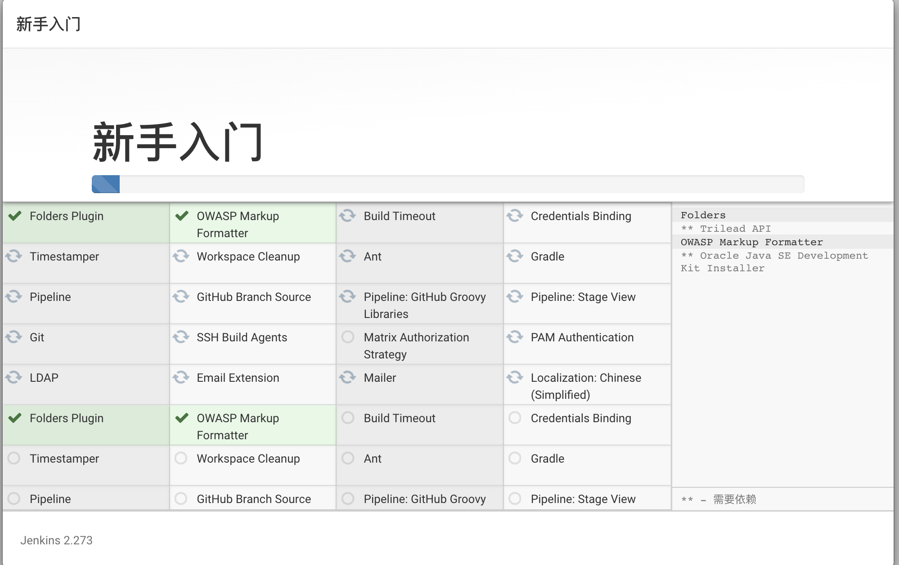
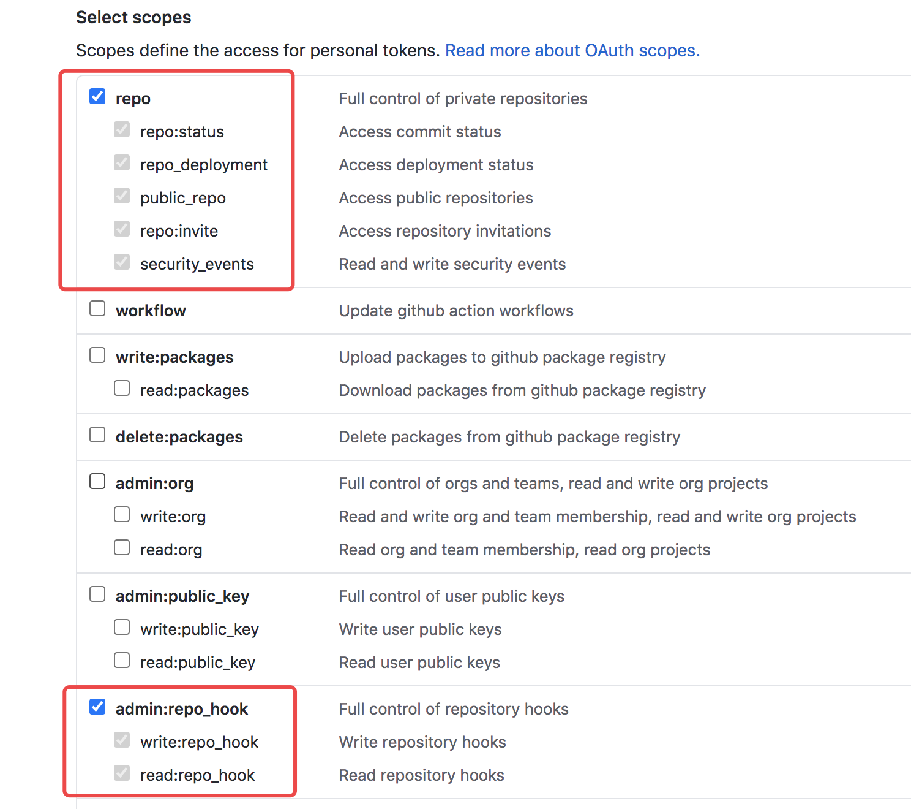
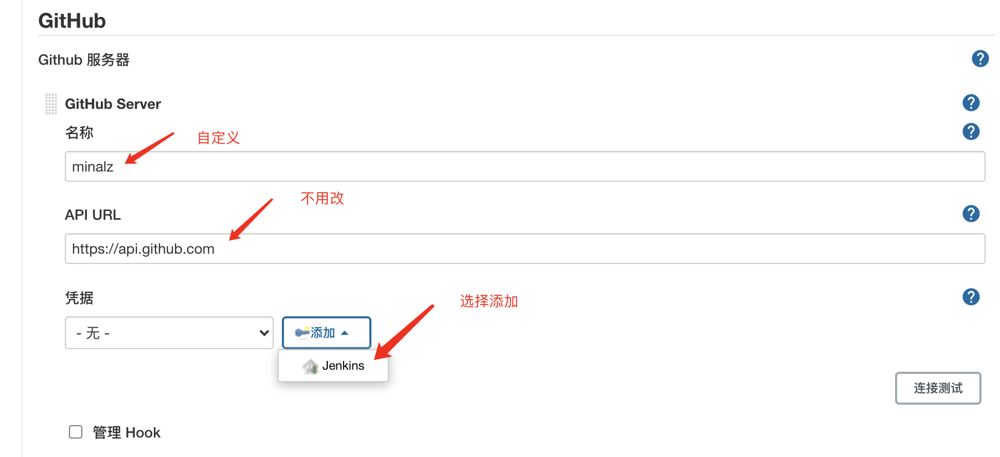
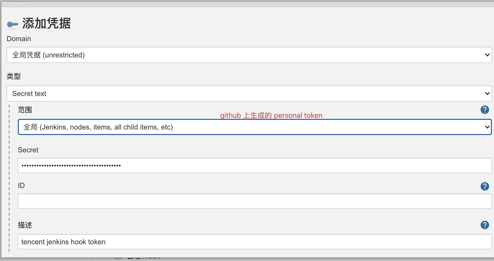
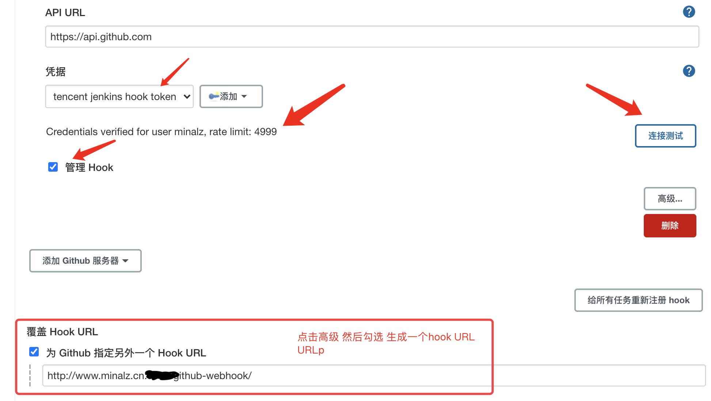
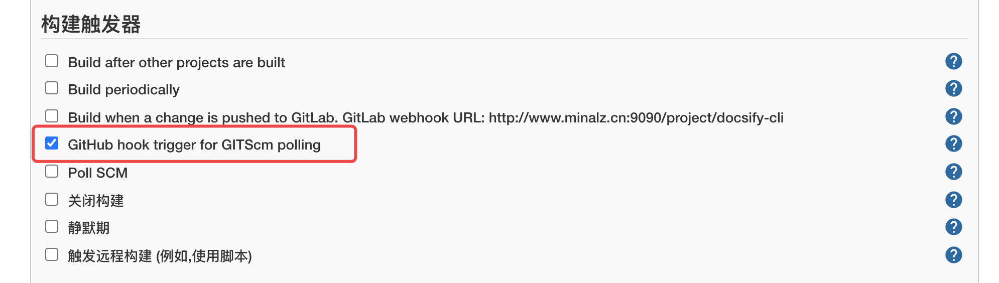

# Docker + Docsify + jenkins搭建CICD的步骤

## 1.需要安装java环境

下载jdk然后安装,配置环境变量即可

```shell
vi /etc/profile
export JAVA_HOME=/usr/local/java8/jdk1.8.0_181
export PATH=$PATH:$JAVA_HOME/bin
source /etc/profile
验证:
java -version
```


## 2.安装git

```shell
yum install git
验证:
git --version
Linux配置git:
git config --global user.name "your account"
git config --global user.email "your email"
ssh-keygen -t rsa -C "your email"
生成的公钥在:/root/.ssh/id_rsa.pub
复制公钥的内容,上传到github上,生成密钥
```

如下图添加即可:


测试是否配置成功:

```shell
ssh -T git@github.com

Hi minalz! You've successfully authenticated, but GitHub does not provide shell access.
如果出现类似语句,说明成功了
```


## 3.安装docker

### 3.1 卸载之前的docker

```sh
sudo yum remove docker \
                  docker-client \
                  docker-client-latest \
                  docker-common \
                  docker-latest \
                  docker-latest-logrotate \
                  docker-logrotate \
                  docker-engine
```

### 3.2 安装必要的依赖

```sh
sudo yum install -y yum-utils \
    device-mapper-persistent-data \
    lvm2
```

### 3.3 设置docker仓库

```sh
sudo yum-config-manager \
      --add-repo \
      https://download.docker.com/linux/centos/docker-ce.repo
```

如果添加错了，用下面的链接修改(因为上面的命令再执行一遍也不会覆盖，是没用的)：

参考链接：https://blog.csdn.net/m0_47333020/article/details/108738569

### 3.4 安装docker

```sh
sudo yum install -y docker-ce docker-ce-cli containerd.io
```

### 3.5 启动docker

```sh
sudo systemctl start docker
```

### 3.6 添加镜像加速器，这里用的是阿里云

使用自己的阿里云账号登录，查看菜单栏左下角，发现有一个镜像加速器:

参考链接：https://cr.console.aliyun.com/cn-hangzhou/instances/mirrors

3.7 可以拉取一个hello-world看看是否可以正常运行

```shell
docker run hello-world

出现以下说明没问题:
Unable to find image 'hello-world:latest' locally
latest: Pulling from library/hello-world
0e03bdcc26d7: Pull complete 
Digest: sha256:1a523af650137b8accdaed439c17d684df61ee4d74feac151b5b337bd29e7eec
Status: Downloaded newer image for hello-world:latest

Hello from Docker!
This message shows that your installation appears to be working correctly.
...
```


## 4.jenkins

### 4.1 下载jenkins.war

```shell
wget http://mirrors.jenkins.io/war-stable/latest/jenkins.war
```

下载特别慢,最好自己找其他资源下载,版本低了可以安装好了后再选择`在线升级`

### 4.2 启动

```java
nohup java -Dhudson.util.ProcessTree.disable=true -jar jenkins.war --httpPort=9090 &
  
查看日志:
tail -f nohup.out
```

execute shell中启动的进程在Job退出时会被杀死，所以需要加参数

`-Dhudson.util.ProcessTree.disable=true`

### 4.3 访问jenkins

#### 4.3.1 访问的时候需要输入密码:

```shell
cat /root/.jenkins/secrets/initialAdminPassword
```

#### 4.3.2 安装推荐的插件:



#### 4.3.3 如果插件下载不成功,修改插件的更新地址试试:

```shell
https://mirrors.tuna.tsinghua.edu.cn/jenkins/updates/update-center.json
```

#### 4.3.4 创建一个用户

```shell
username: admin01
password: admin01
```

#### 4.3.5 配置git java

[系统管理]->[全局工具配置]->[JDK、Git]


## 4.4 配置jenkins

### 4.4.1 定义pipeline 测试是否可以成功

```shell
node {
    
   // 拉取git上的代码
   stage('Preparation') {
      git 'https://github.com/minalz/docsify-cli.git'
   }
  
}
```

### 4.4.2 git push触发jenkins自动构建

> `最好的话`:当用户进行git commit/push提交代码到github时，能够通知**jenkins自动构建**
>
> `注意`:jenkins的ip一定要是github能够访问到的地址

> (1)在github上配置jenkins的webhook地址
>
> http://你的ip:9090/github-webhook

> (2)生成Personal access tokens
>
> Jenkins访问github需要授权，所以在github上生成token交给jenkins使用，即`Personal access tokens`
>
> github的Settings[个人信息右上角]-->Developer settings-->Personal access tokens-->Generate new token
>
> 最后保存好该token，比如:**72f048b514e95d6fe36f86d84374f2dcce402b43
>
> 

> (3)jenkins安装插件

```
01 安装github plugin插件:[系统管理]->[插件管理]->[可选插件]
02 安装gitlab插件和gitlab hook插件:[系统管理]->[插件管理]->[可选插件]
```

> (4)配置GitHub Server
>
> [系统管理]->[系统配置]->[找到github服务器]->[添加github服务器]
>
> 添加github服务器
>
> 
>
> 添加凭据
>
> 

进行测试



一定要在配置pipeline中配置这个,否则无法出发push



## 4.5 编写脚本

### 4.5.1 最终pipeline:

```shell
node {
    
   // 拉取git上的代码
   stage('Preparation') {
      git 'https://github.com/minalz/docsify-cli.git'
   }
   
   // 开始构建
   stage('Build') { 
      sh "/root/.jenkins/workspace/scripts/docsify-docker-build.sh"
   }

   // 开始推送镜像
   stage('Push') { 
      sh "/root/.jenkins/workspace/scripts/docsify-docker-push.sh"
   }

   // 开始运行
   stage('Run') { 
      sh "/root/.jenkins/workspace/scripts/docsify-docker-run.sh"
      // sh "BUILD_ID=DONTKILLME;nohup docsify serve docs > /usr/local/myapp/docsify-cli.log 2>&1 &"
   }
}
```

### 4.5.2 创建脚本

### 4.5.1 下载的代码在`/root/.jenkins/workspace/`

```shell
cd /root/.jenkins/workspace/
mkdir workspace
vi pwd.txt 然后输入docker hub的密码 我这里是用的阿里云的镜像仓库
wq
```

#### 4.5.2 docsify-docker-build.sh

```shell
echo "==========开始Build=========="
# 进入到docsify-cli目录
cd ../docsify-cli/docs

# 编写Dockerfile文件
cat <<EOF > Dockerfile
FROM node:10-alpine
COPY  /   /docs/
WORKDIR /docs
RUN npm i docsify-cli -g --registry=https://registry.npm.taobao.org
EXPOSE 3000/tcp
ENTRYPOINT docsify serve .
EOF

echo "Dockerfile created successfully!"

# 定义镜像名称
imageNameAndTag="registry.cn-hangzhou.aliyuncs.com/first-repo/docsify-cli:v1.0"

# 删除正在运行的container 如果先删除images 会导致image名称被删掉 但是数据还是在的 需要等成功上传到镜像仓库后才能删除 所以需要分两步

# 先判断旧的container(docsify-cli)是否存在 如果存在 也需要进行删除 否则无法启动的
if [[ "$(docker ps -as | grep docsify-cli 2> /dev/null)" != "" ]]; then
  echo "存在运行中的container容器，需要删除"
  docker rm -f docsify-cli
  echo "删除container成功"
fi

# 先删除旧的images
if [[ "$(docker images -q ${imageNameAndTag} 2> /dev/null)" != "" ]]; then
  echo "存在旧的image镜像，需要删除"
  docker rmi -f ${imageNameAndTag}
  echo "删除image成功"
fi

# 基于指定目录下的Dockerfile构建镜像
docker build -t ${imageNameAndTag} .
echo "==========结束Build=========="
```

####  4.3.3.3 docsify-docker-push.sh

```shell
echo "==========开始Push=========="
# 定义镜像名称
imageNameAndTag="registry.cn-hangzhou.aliyuncs.com/first-repo/docsify-cli:v1.0"

# 登录阿里云镜像仓库
cat /root/.jenkins/workspace/scripts/pwd.txt | docker login -u kawayi125 registry.cn-hangzhou.aliyuncs.com --password-stdin

# push镜像
docker push ${imageNameAndTag}
echo "==========结束Push=========="
```

####  4.3.3.4 docsify-docker-run.sh

```shell
echo "==========开始Push=========="
# 定义镜像名称
imageNameAndTag="registry.cn-hangzhou.aliyuncs.com/first-repo/docsify-cli:v1.0"

# 登录阿里云镜像仓库
cat /root/.jenkins/workspace/scripts/pwd.txt | docker login -u youraliaccount registry.cn-hangzhou.aliyuncs.com --password-stdin

# push镜像
docker push ${imageNameAndTag}
echo "==========结束Push=========="
[root@VM-0-3-centos scripts]# cat docsify-docker-run.sh 
echo "==========开始Run=========="
# 定义镜像名称
imageNameAndTag="registry.cn-hangzhou.aliyuncs.com/first-repo/docsify-cli:v1.0"

# 运行镜像
docker run -d --name docsify-cli -p 80:3000 ${imageNameAndTag}
echo "==========结束Run=========="
```

#### 4.3.3.5 给脚本赋权

```shell
chmod +x docsify-*
```

#### 4.3.3.6 访问blog地址

yourIp:port