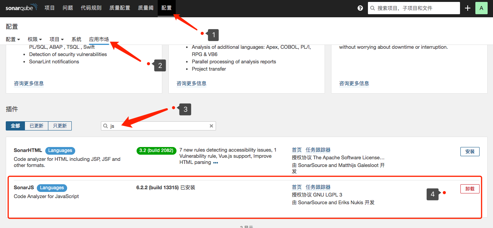
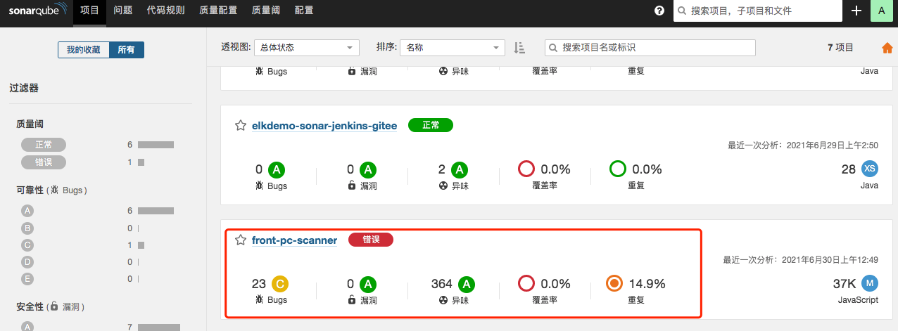

# SonarQube扫描前端代码

## 1.安装插件



## 2.在项目根路径下创建sonar-project.properties

```properties
# must be unique in a given SonarQube instance
sonar.projectKey=front-pc-scanner
# this is the name and version displayed in the SonarQube UI. Was mandatory prior to SonarQube 6.1.
sonar.projectName=front-pc-scanner
sonar.projectVersion=1.0

# Path is relative to the sonar-project.properties file. Replace "\" by "/" on Windows.
# This property is optional if sonar.modules is set.
sonar.sources=./src

# Encoding of the source code. Default is default system encoding
sonar.sourceEncoding=UTF-8
```

## 3.执行扫描

```sh
sonar-scanner
```

### 4.查看结果

