# docker-compose搭建SonarQube

## 1.准备工作

```sh
# 临时生效
sysctl -w vm.max_map_count=262144
sysctl -w fs.file-max=65536
ulimit -n 65536
ulimit -u 4096
# 重启生效
echo "sonar   -   nofile   65536
sonar   -   nproc    4096" > /etc/security/limits.d/99-sonarqube.conf
echo "vm.max_map_count=262144
fs.file-max=65536" > /etc/sysctl.d/99-sonarqube.conf
# 创建容器映射路径
mkdir -p /home/sonar/postgres/{postgresql,data}
mkdir -p  /home/sonar/sonarqube/{extensions,logs,data,conf}
chmod -R 777 /home/sonar/*  # 启动容器映射路径权限问题
```

## 2.新建docker-compose.yaml

```dockerfile
version: '3.1'
services:
  postgres:
    image: postgres:12.3
    restart: always
    container_name: my-postgres
    ports:
      - 9002:5432
    volumes:
      - /home/sonar/postgres/postgresql:/var/lib/postgresql
      - /home/sonar/postgres/data:/var/lib/postgresql/data
      - /etc/localtime:/etc/localtime:ro
    environment:
      TZ: Asia/Shanghai
      POSTGRES_USER: sonar
      POSTGRES_PASSWORD: sonar
      POSTGRES_DB: sonar

  sonar:
    image: sonarqube:7.9.2-community
    container_name: my-sonar
    depends_on:
      - postgres
    volumes:
      - /home/sonar/sonarqube/extensions:/opt/sonarqube/extensions
      - /home/sonar/sonarqube/logs:/opt/sonarqube/logs
      - /home/sonar/sonarqube/data:/opt/sonarqube/data
      - /home/sonar/sonarqube/conf:/opt/sonarqube/conf
      # 设置与宿主机时间同步
      - /etc/localtime:/etc/localtime:ro
    ports:
      - 9001:9000
    command:
      # 内存设置
      - -Dsonar.ce.javaOpts=-Xmx2048m
      - -Dsonar.web.javaOpts=-Xmx2048m
      # 设置服务代理路径
      - -Dsonar.web.context=/
      # 此设置用于集成gitlab时，回调地址设置
      - -Dsonar.core.serverBaseURL=https://sonarqube.example.com
    environment:
      TZ: Asia/Shanghai
      SONARQUBE_JDBC_USERNAME: sonar
      SONARQUBE_JDBC_PASSWORD: sonar
      SONARQUBE_JDBC_URL: jdbc:postgresql://postgres:5432/sonar
```

## 3.创建容器

```sh
docker-compose up -d
```

## 4.登录sonarqube

```http
http://yourserver:9000
```

```properties
账号: admin
密码: admin
```

## 5.汉化

```http
https://github.com/xuhuisheng/sonar-l10n-zh/releases/tag/sonar-l10n-zh-plugin-1.29
```

下载好插件 然后上传到`~/sonarqube/extensions/downloads`目录中,也可以根据步骤6,到应用市场直接下载插件,但是会比较慢 然后重启`docker-compose restart`

## 6.添加Java语言插件

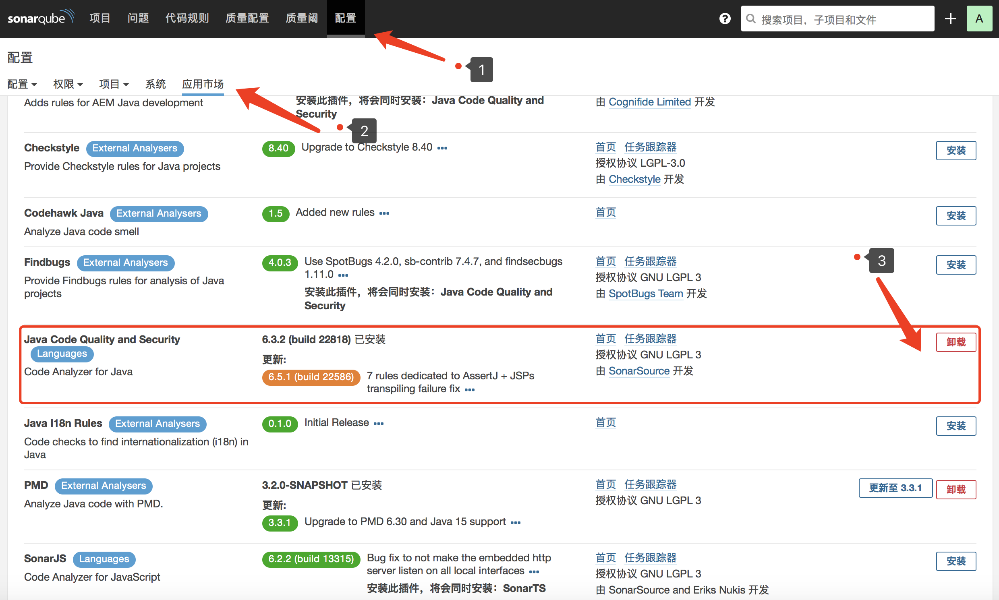

## 7.由于我们要扫描Java的应用,所以需要下载规则插件来校验

这里选择的是阿里的p3c

```http
https://github.com/rhinoceros/sonar-p3c-pmd/releases/tag/pmd-3.2.0-beta-with-p3c1.3.6-pmd6.10.0
```

下载`sonar-pmd-plugin-3.2.0-SNAPSHOT.jar`,然后上传到`~/sonarqube/extensions/downloads`目录中,重启生效

## 8.配置规则

### 8.1 创建新的语言配置

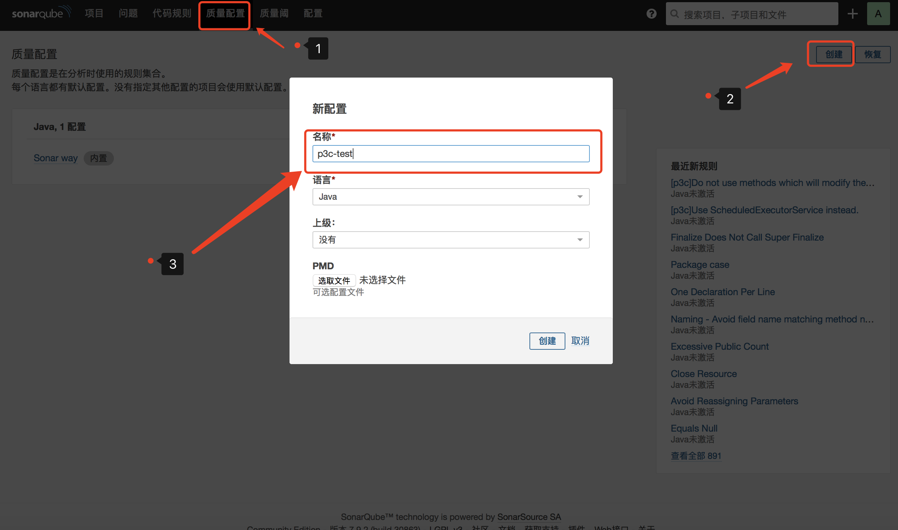

### 8.2 激活配置

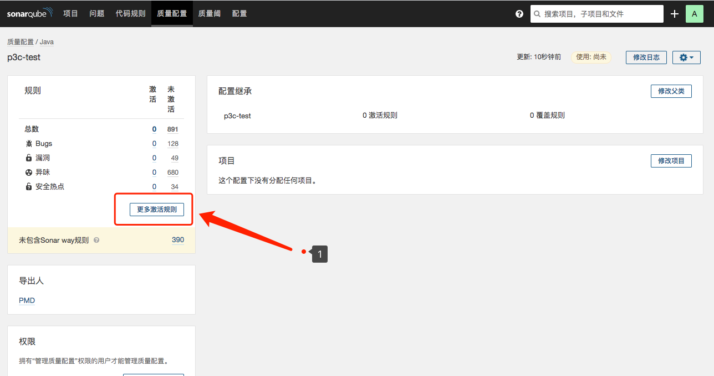

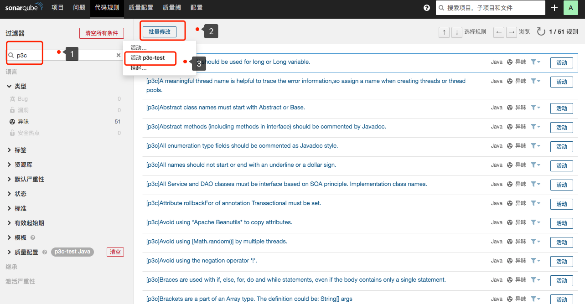

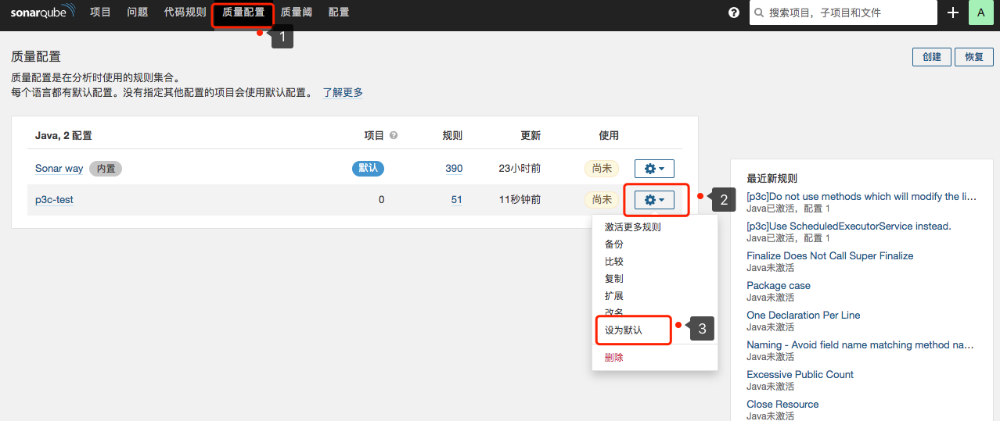

9.项目连接到SonarQube服务器中

9.1 maven直接连接

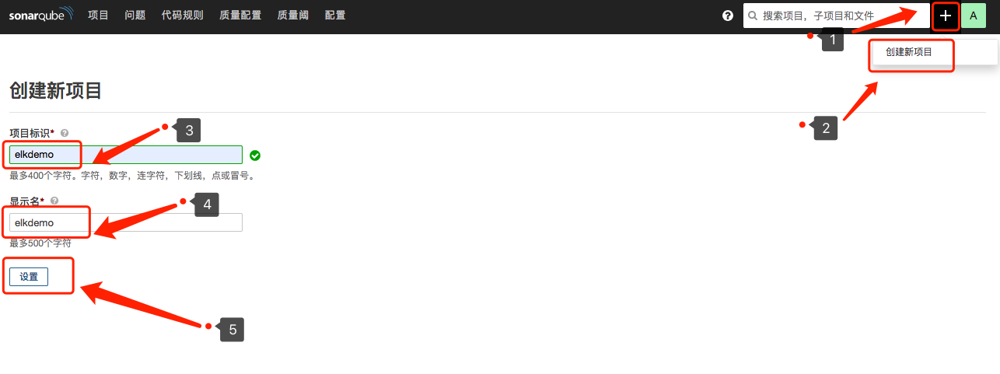

点击设置后,会跳转到创建令牌页面

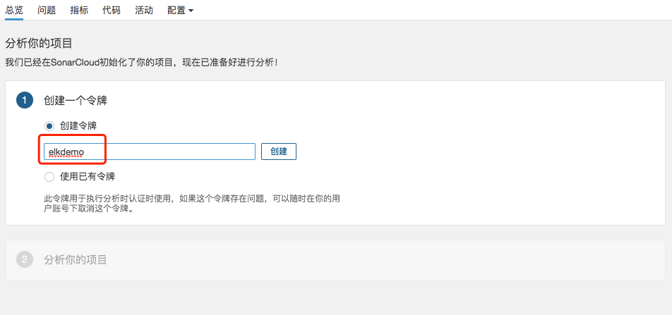

输入一个token名字,随后获取到一个token密钥

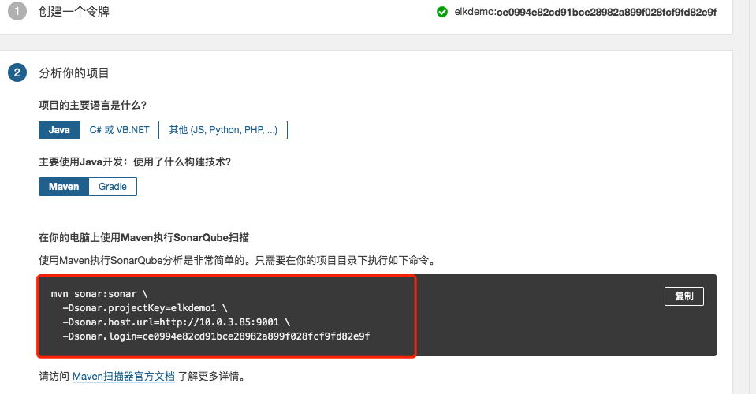

使用如下的命令可以进行连接SonarQube,校验代码了

```sh
mvn sonar:sonar \
  -Dsonar.projectKey=elkdemo1 \
  -Dsonar.host.url=http://10.0.3.85:9001 \
  -Dsonar.login=ce0994e82cd91bce28982a899f028fcf9fd82e9f
```

可能会有如下的出错信息

```text
SCM provider autodetection failed. Please use "sonar.scm.provider" to define SCM of your project, or disable the SCM Sensor in the project settings
```

这是因为启动命令有错，需要单独加一个参数

```text
# 先试这个，一般可以的
-Dsonar.scm.disabled=true
# 如果不行
-Dsonar.scm.provider=git
```

最终完整的命令如下:

```sh
# 支持生成单元测试的覆盖率和接口测试的覆盖率 可以在单元测试时统计单元测试的覆盖率
mvn clean org.jacoco:jacoco-maven-plugin:prepare-agent install \
sonar:sonar \
  -Dsonar.projectKey=elkdemo \
  -Dsonar.host.url=http://10.0.3.85:9001 \
  -Dsonar.login=827179f3f1547e2f5bac5282198fea99a9e5ab74 \
  # 如果单元测试失败 可以继续执行
  -Dmaven.test.failure.ignore=true \
  -Dsonar.scm.disabled=true
```

### 9.2 pom.xml中进行配置SonarQube的服务器

```xml
# 添加pom
<plugin>
  <groupId>org.sonarsource.scanner.maven</groupId>
  <artifactId>sonar-maven-plugin</artifactId>
  <version>3.6.0.1398</version>
</plugin>

# 添加plugin
<profiles>
  <profile>
    <id>sonar</id>
    <activation>
      <activeByDefault>true</activeByDefault>
    </activation>
    <properties>
      # localhost 改成自己SonarQube的IP
      <sonar.jdbc.url>jdbc:postgresql://localhost:9002/sonar</sonar.jdbc.url>
      <sonar.jdbc.driver>org.postgresql.Driver</sonar.jdbc.driver>
      # 这是posgresql中配置的 用户名和密码
      <sonar.jdbc.username>sonar</sonar.jdbc.username>
      <sonar.jdbc.password>sonar</sonar.jdbc.password>
      <sonar.host.url>http://localhost:9001</sonar.host.url>
      # 只扫描指定路径下的文件
      <sonar.inclusions>src/main/**</sonar.inclusions>
      # scm错误关闭
      <sonar.scm.disabled>true</sonar.scm.disabled>
    </properties>
  </profile>
</profiles>
```

执行:

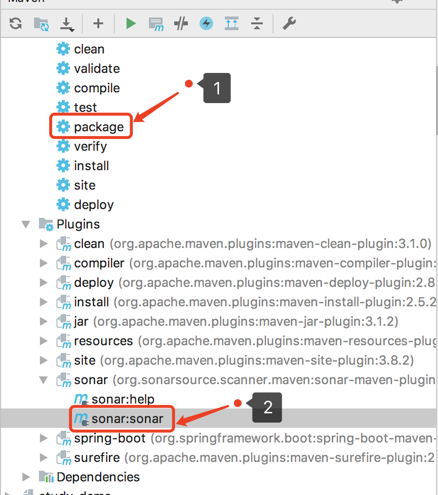

### 9.3 sonar-scanner的方式

适用于其他语言,java不一定要用这,maven完美支持sonar的插件

```http
# 历史版本下载地址
https://binaries.sonarsource.com/Distribution/sonar-scanner-cli/
```

#### 9.3.1 需要单独安装一个sonar-scanner的服务

```sh
# Mac版本:
# 安装
brew install sonar-scanner
# 设置环境变量
vi ~/.bash_profile
export SONAR_RUNNER_HOME=/usr/local/Cellar/sonar-scanner/4.5.0.2216/bin
# 验证安装是否成功
sonar-scanner -v

# windows版本原理是差不多的
```

#### 9.3.2 在项目根目录下设置sonar-project.properties的配置

文件位置: `/usr/local/Cellar/sonar-scanner/4.5.0.2216/libexec/conf`

```properties
#Configure here general information about the environment, such as SonarQube server connection details for example
#No information about specific project should appear here

#----- Default SonarQube server
sonar.host.url=http://localhost:9000

sonar.jdbc.username=admin

sonar.jdbc.password=admin

#----- Default source code encoding
sonar.sourceEncoding=UTF-8
```

得到的结果如下图:

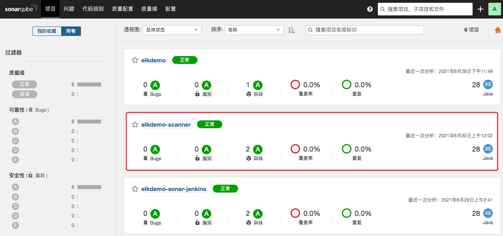

#### 9.3.3 参考链接

```http
https://blog.csdn.net/wxmiy/article/details/89740578
```

## 10.前几步执行完毕,都没有问题,说明扫描成功了,回到SonarQube的UI界面

看到如下信息,说明成功了,我们点击项目进去看详细信息

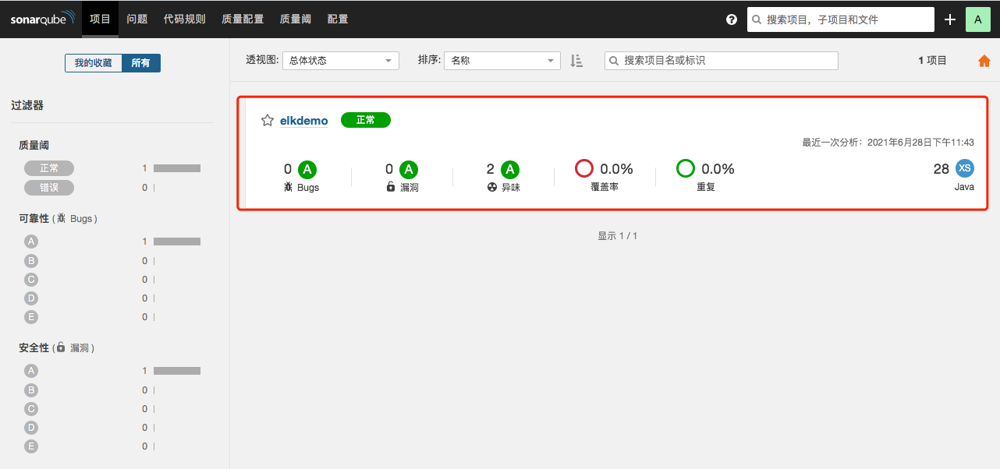

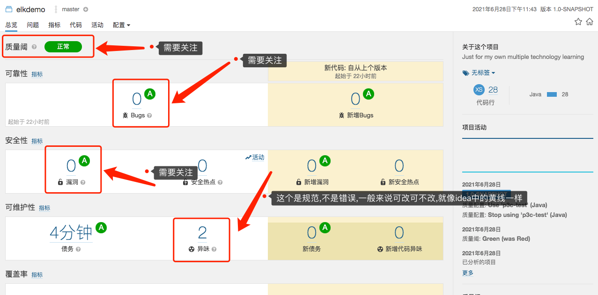

因为我这是demo,所以没什么问题,点异味进去看一下,是什么规则不规范

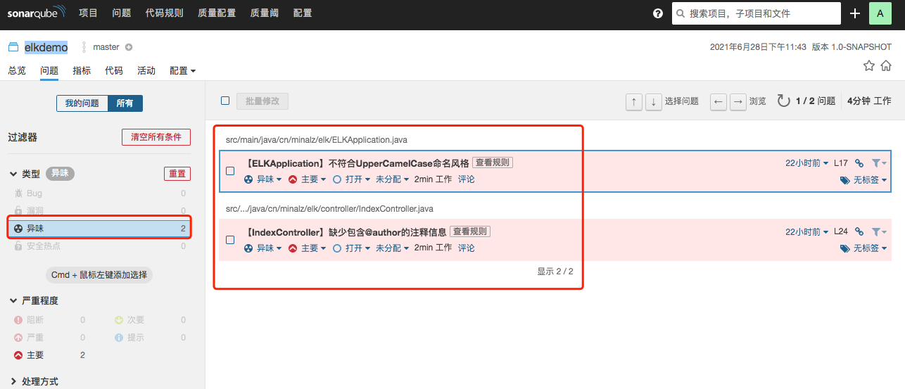

我们看第二个,说少了@author的注释信息

我们代码中改一下,加上去一段试试,再次扫描

```java
/**
 *
 * 接口控制器
 * @author minalz
 * @date 2021/06/328
 */
```

刚才的问题解决了

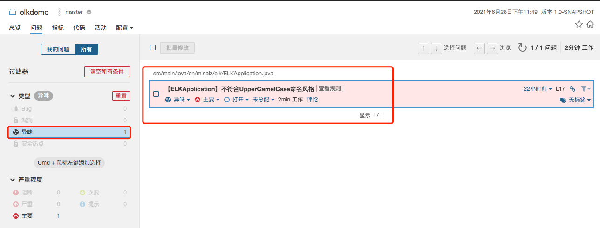

因为这是比较少的,分配人员修改还是比较方便,但是当一个项目有数十万行代码,每次提交大量功能的时候,这时候就不怎么方便了,所以需要集成jenkins来进行操作了

## 11.docker-compose其他命令

```sh
docker-compose stop # 停止所有容器
docker-compose rm # 删除所有容器
docker-compose restart # 重新启动所有容器
```

