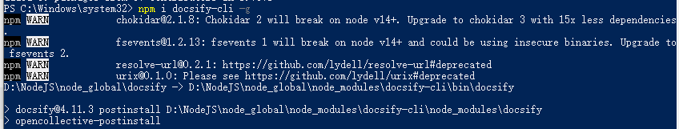
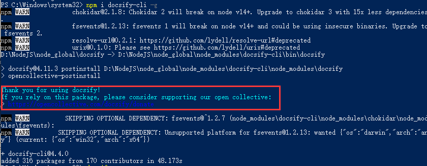
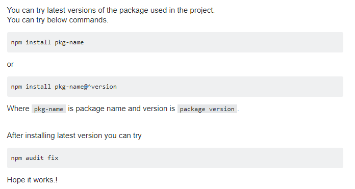
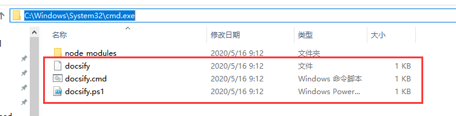
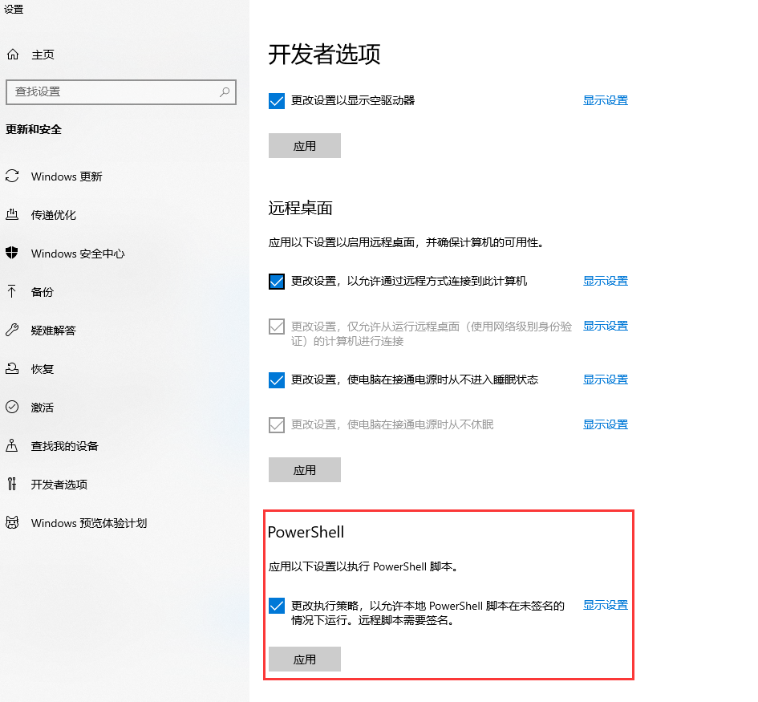
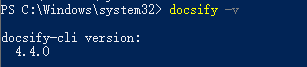

# windows10安装docsify遇到的问题

#### 1.node安装好之后，出现问题



开始以为是node版本问题，然后重新卸载，安装了一个高版本的，还是如此，但是多了一个新的提示



根据新的提示去百度，让npm install pkg-name



可还是如此，解决不了，又变成了一开始的提示的，没有了颜色字体的提示了

然后配置了环境变量，在path中添加了

```html
C:\Windows\System32\cmd.exe
```



然后继续运行，还是不行，用的是win10的powershell管理员权限，还是提示没有这个命令

但是我切换到了DOS窗口，普通的命令行，居然是可以识别的

后面想会不会是什么权限问题呢，于是就找到了下面的这篇链接：

https://blog.csdn.net/github_39506988/article/details/89920475

#### 2.完美解决

方法一：

默认执行策略

```html
Restricted   //不允许任何脚本运行
```

查询当前执行策略

```html
get-executionpolicy
# Unrestricted   //  未签名的脚本可以运行。（这存在运行恶意脚本的风险。）
# RemoteSigned //  要求从 Internet 下载的脚本和配置文件（包括电子邮件和即时消息程序）具有受信任的发布者的数字签名
# AllSigned // 要求所有脚本和配置文件都由受信任的发布者签名，包括在本地计算机上编写的脚本
# Restricted // 允许单独的命令，但不会运行脚本。
# PROCESS // 执行策略仅影响当前会话（当前 Windows PowerShell 进程）。
# CURRENTUSER  // 执行策略仅影响当前用户。它存储在 HKEY_CURRENT_USER 注册表子项中。
# Bypass // 不阻止任何内容，并且没有任何警告或提示。
# Undefined // 当前作用域中未设置执行策略。
# LOCALMACHINE // 执行策略会影响当前计算机上的所有用户。它存储在 HKEY_LOCAL_MACHINE 注册表子项中。
```

在默认情况下，我们是无法执行powershell脚本的， 需要更改执行策略

执行一下这个命令，双击回车, 会显示可选的执行策略

```html
Set-ExecutionPolicy
# or
Set-ExecutionPolicy -Scope CurrentUser
```

复制粘贴` RemoteSigned` 再次点击回车切换执行策略

方法二：



再输入docsify就正常了



至此，终于搞定了。。。

