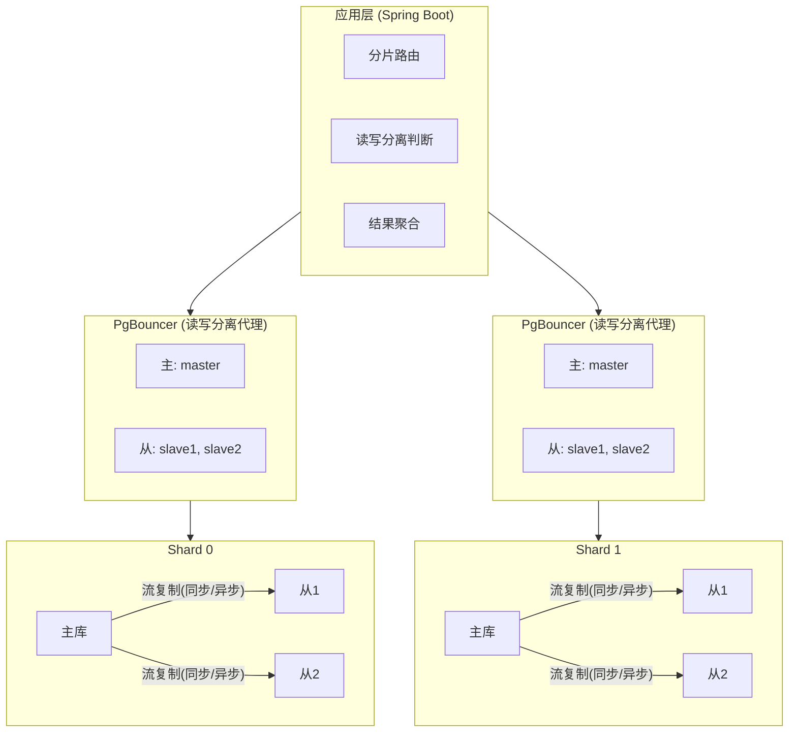

# 🎨 PgVector 架构

> 🔄 PgVector 分片 + 读写分离架构可视化

---

## 🖼️ PgVector 分片读写分离架构图

---

## 📝 说明

> 💡 展示 PgVector 基于分片(Shard) + 读写分离(PgBouncer)的高可用向量检索架构。应用层负责分片路由与读写分离判断，每个 PgBouncer 代理对应一个 Shard，每个 Shard 内主库通过流复制(同步/异步)同步到从库。
