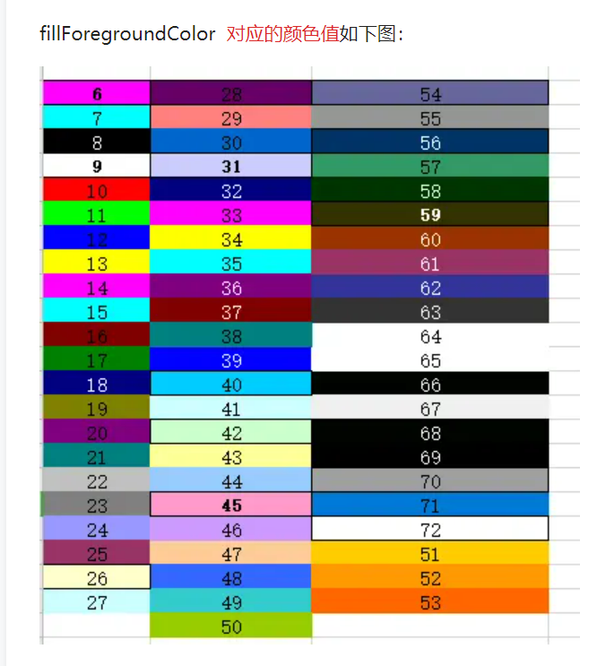

## 1.Kafka顺序消费问题
https://blog.csdn.net/qq_31329893/article/details/90451889

## 2.双写如何保证最终一致性
https://www.cnblogs.com/yanglang/p/9098661.html

## 3.RocketMQ的安装
https://blog.csdn.net/weixin_42979871/article/details/104382458

## 4.常用正则表达式
http://mp.weixin.qq.com/s?__biz=Mzg3NDQyOTQ1MQ==&mid=2247488933&idx=1&sn=822239e22b2bacdff8d9068122c70b6b&chksm=ced1b8c1f9a631d7c9201479600a424e4ef71f5ff3937c9600eff22f706142466f95d656f6b0&mpshare=1&scene=1&srcid=1025iuveKMlZni89iybHJN5O&sharer_sharetime=1635130446275&sharer_shareid=c174fc82bedf5e65f42874fb5e2af3ca#rd

## 5.Logback配置文件这么写，TPS提高10倍
https://juejin.cn/post/6844903909920604174

## 6.多次提交，github上却没有记录contribution
https://blog.csdn.net/zwf193071/article/details/108140938?spm=1001.2101.3001.6661.1&utm_medium=distribute.pc_relevant_t0.none-task-blog-2%7Edefault%7ECTRLIST%7ERate-1.pc_relevant_paycolumn_v3&depth_1-utm_source=distribute.pc_relevant_t0.none-task-blog-2%7Edefault%7ECTRLIST%7ERate-1.pc_relevant_paycolumn_v3&utm_relevant_index=1
或者下面的这种方式更简单：
https://blog.csdn.net/qq_41893551/article/details/106716873?spm=1001.2101.3001.6650.3&utm_medium=distribute.pc_relevant.none-task-blog-2%7Edefault%7ECTRLIST%7ERate-3.pc_relevant_aa&depth_1-utm_source=distribute.pc_relevant.none-task-blog-2%7Edefault%7ECTRLIST%7ERate-3.pc_relevant_aa&utm_relevant_index=6

## 7.EasyExcel合并单元格
https://blog.csdn.net/tanqingfu1/article/details/121233373

## 反射获取List类型
https://blog.csdn.net/whatzhang007/article/details/111664175

## MyBatis-plus 自带QueryWrapper自定义sql实现复杂查询
https://blog.csdn.net/qq_44695727/article/details/123434199