# 201809笔记

## 1.extjs的字段排序

### 1.1 3.X版本

#### 1.1需要添加

```javascript
remoteSort:true sorts:[‘field1’,’field’]
```

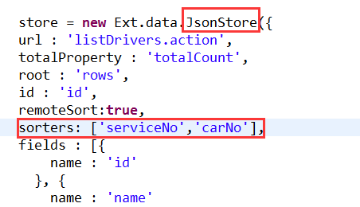

#### 1.2字段上添加

```javascript
sortable:true
```


这两步对于EXT 3.X版本都是需要的 其中`sorters`是指定排序字段 可写可不写  而4.X版本 只需要`sortable：true`就可以了

#### 1.2 4.X版本

## 2.PHP的LAMP环境搭建(WAMP简单 配置比较多)

如何搭建`lamp(CentOS7+Apache+MySQL+PHP)`环境
说说我的环境：
Linux系统用的是阿里云，用的CentOS7-64bit
准备好这两个之后，就开始一步一步搭建我们的LAMP环境了。

### 2.1安装Apache

#### 2.1.1.安装

```javascript
yum -y install httpd
```


#### 2.1.2.开启apache服务

```javascript
systemctl start httpd.service
```


#### 2.1.3.设置apache服务开机启动

```j
systemctl enable httpd.service
```

j

#### 2.1.4.验证apache服务是否安装成功

在本机浏览器中输入虚拟机的ip地址，CentOS7查看ip地址的方式为：
`ip addr`
（阿里云不需要用这种方式查看，外网ip已经在你主机列表那里给你写出来了的；）
这里是访问不成功的
（阿里云用外网访问，能成功，不需要做以下步骤）
查了资料，说法是，CentOS7用的是`Firewall-cmd`，CentOS7之前用的是iptables防火墙；要想让外网能访问到apache主目录，就需要做以下的操作：

```shell
firewall-cmd --permanent --zone=public --add-service=http
firewall-cmd --permanent --zone=public --add-service=https
firewall-cmd --reload
```

然后再访问外网ip，如果看到apache默认的页面--有`Testing 123...`字样，便是成功安装了apache服务了；

### 2.2安装PHP

#### 2.2.1.安装

```shell
yum -y install php
```


#### 2.2.2.重启apache服务

`systemctl restart httpd`或者`systemctl restart httpd.service`
然后，你可以写一个php文件在浏览器中运行一下了;
eg:
vi `/var/www/html/info.php` (`默认的虚拟站点`就是在这里  可以在配置文件中进行修改)

```php
i
<?php phpinfo(); ?>
Esc
:wq
```


然后，在自己电脑浏览器输入 `192.168.1.1/info.php`
运行，会出现php的一些信息

### 2.3安装MySQL

我这里根据所学的那个教程，也安装了MariaDB

#### 2.3.1.安装

`yum -y install mariadb-service mariadb` 前面的是有问题的  不行的话用后面的这个命令`yum -y install mariadb mariadb-server`因为本机有mysql  所以安装mysql这个命令没有试,本机也是用的mysql源码安装的

#### 2.3.2.开启MySQL服务

```shell
systemctl start mariadb.service
```


#### 2.3.3.设置开机启动MySQL服务

```shell
systemctl enable mariadb.service
```


#### 2.3.4.设置root帐户的密码

```shell
mysql_secure_installation
```


然后会出现一串东西，可以仔细读一下，如果你懒得读，就在提示出来的时候，按Enter就好了，让你设置密码的时候，你就输入你想要的密码就行，然后继续在让你选择`y/n`是，`Enter`就好了；当一切结束的时候，你可以输入`mysql -uroot -p`的方式，验证一下；

### 2.4将PHP和MySQL关联起来

```shell
yum search php
```

选择你需要的安装：

```shell
yum -y install php-mysql
```


### 2.5安装常用的PHP模块

例如，`GD库`，`curl`，`mbstring`,...

#### 2.5.1.安装：

```shell
yum -y install php-gd php-ldap php-odbc php-pear php-xml php-xmlrpc php-mbstring php-snmp php-soap curl curl-devel
```


#### 2.5.2.重启apache服务

```shell
systemctl restart httpd.service
```

然后，再次在浏览器中运行info.php，你会看到安装的模块的信息；
至此，LAMP环境就搭建好了。

### 2.6搭建过程中遇到的问题

#### 2.6.1.mysql_connect()没有定义 

linux中是没有添加扩展，然后到/usr/bin/php下 执行 -v  发现少了一个/usr/lib64文件夹少了一个`libmysqlclient.so.18`，到其他的服务器的同样位置拷贝一个下来，执行后可以了
`phpinfo()`；也可以正常打印出mysql的正常信息了

#### 2.6.2.连接还是有问题 

 这次是`Warning: mysql_connect(): Headers and client library minor version mismatch. Headers:50556 Library:50640 in /var/www/html/index.php on line 3`
这是因为客户端版本不一致导致的（解决链接：https://blog.csdn.net/ausboyue/article/details/52790222 仅供参考，真实是用下面的命令解决的 因为多了一个y）

```shell
卸载php-mysql
yum remove php-mysql -y
安装php-mysqlnd
yum install php-mysqlnd -y
重启httpd
systemctl restart httpd.service
```


## 3.配置实体类映射的时候  transient要配置在many-to-one标签后面

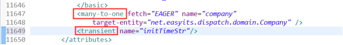

## 4.公司在线率统计选择一个公司后然后点击跳转到明细页面，有的公司会显示在输入框中，有的却不显示，但是是有公司id的

原因是：树是懒加载方式的，只有点击上层后，输入框才会拿到公司的名称，否则就是不显示的，但实际上是有公司id在里面存在的，不影响结果

## 5.树的多选方式(EXT中使用)  是额外引入的一个js（multi_company_drop-down_list.js）  参考carOffLineInfo.jsp

## 6.Extjs 下拉框默认选中一个值 在渲染之后

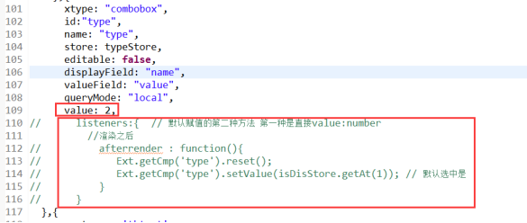

## 7.Extjs loadMask遮罩的问题

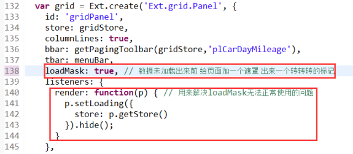

## 8.公司List<Long> 作为in条件 遍历到sql中

```java
if (companyIds.size() > 0) {
			sb.append(" and company_id in (");
			for (int i = 0; i < companyIds.size(); i++) {
				long companyId = companyIds.get(i);
				sb.append(companyId);
				if (companyIds.size() - 1 != i) {
					sb.append(",");
				}
			}
			sb.append(") ");
		}
```

## 9.Extjs 是的grid具有title的效果 因为有的列内容太多 无法全显示

(参考链接:https://www.cnblogs.com/bomwu/p/3492643.html EXTjs4.X)
(参考链接:https://blog.csdn.net/jcy472578/article/details/48223903?locationNum=11 EXTjs3.X)

### 9.1.先开启 快速提示的开关按钮

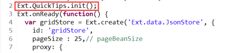

在columns中添加renderer

```javascript
Ext.QuickTips.init();
'<span data-qtip="'+val+'">'+val+'</span>'
```

### 9.2.在grid中开启cellTip:true

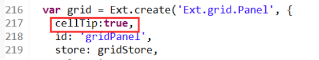

覆盖方法  对所有的列都生效
//适用于`Extjs4.x`  为了让grid的表格 呈现title的效果 (注意：这里需要在grid中绑定一个`cellTip:true`)  起到tooltip的效果  mdtVersion 也有一个同样的功能 但是实现方式是不同的  原因在于extjs的版本是不同的

```javascript
Ext.override(Ext.grid.GridPanel, {
    afterRender : Ext.Function.createSequence(Ext.grid.GridPanel.prototype.afterRender,
        function() {
            if (!this.cellTip) {
                return;
            }
            var view = this.getView();
            this.tip = new Ext.ToolTip({
                target : view.el,
                delegate : '.x-grid-cell-inner',
                trackMouse : true,
                renderTo : document.body,
                listeners : {
                    beforeshow : function updateTipBody(tip) {
                        if (Ext.isEmpty(tip.triggerElement.innerHTML)) {
                            return false;
                        }
                        tip.body.dom.innerHTML = tip.triggerElement.innerHTML;
                    }
                }
            });
        })
});
```

#### 3.X系列的

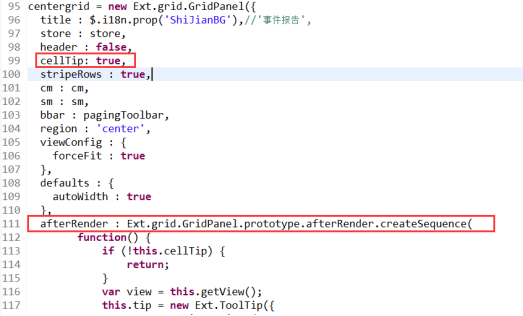

// 宽度自适应 如果ColumnModel中不设置width的话 使得每个列的宽度自适应(其实是一样大小的)  默认就是true

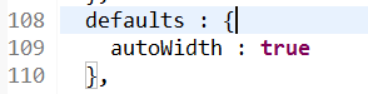

#### 4.X 系列的

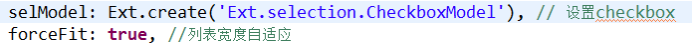

```javascript
//适用于Extjs3.x
Ext.override(Ext.grid.GridPanel, {
afterRender : Ext.grid.GridPanel.prototype.afterRender.createSequence(
    function() {
        if (!this.cellTip) {
            return;
        }
        var view = this.getView();
        this.tip = new Ext.ToolTip({
            target : view.mainBody,
            delegate : '.x-grid3-cell-inner',
            trackMouse : true,
            renderTo : document.body,
            listeners : {
                beforeshow : function updateTipBody(tip) {
                    if (Ext.isEmpty(tip.triggerElement.innerText)) {
                        return false;
                    }
                    tip.body.dom.innerHTML = tip.triggerElement.innerText;
                }
            }
        });
    })
});
```

### 9.3.绑定render方法 覆盖渲染函数(适用3.X系列 自己测试4.X没成功 最后用的第二种方法全覆盖的，如果只是需要个别几个列效果 用第一种方法就可以了)

```javascript
centergrid.on('render', function(grid) {   
    var store = grid.getStore(); 
    var view = grid.getView();  
    centergrid.tip = new Ext.ToolTip({   
        target: view.mainBody,   
        delegate: '.x-grid3-cell',
        trackMouse: true,        
        renderTo: document.body,
        minWidth:200,
        maxWidth:500,
        listeners: {            
            beforeshow: function updateTipBody(tip) {   
                var rowIndex = view.findRowIndex(tip.triggerElement); 
                var cellIndex = view.findCellIndex(tip.triggerElement); 
                //前三列或大于第八列内容不提示  
//                if(cellIndex < 3 || cellIndex >8){
//                	return false;  
//                }
                var cell = view.getCell(rowIndex, cellIndex); 
                if(new RegExp("&nbsp;").test(cell.innerHTML)){
                	return false;
                }
                tip.body.dom.innerHTML = cell.innerHTML;  
//                tip.body.dom.innerHTML = "Over Record ID " + store.getAt(cellIndex).id;   
            }   
        }   
    });   
});
```

注：有的空白列是不想让它显示title效果的 用正则表达式去判断是否有空格 EXT中默认返回的空格是实体字符&nbsp;

```javascript
var cell = view.getCell(rowIndex, cellIndex); 
if(new RegExp("&nbsp;").test(cell.innerHTML)){
   return false;
}
```


## 10.distributionManagement解释

链接：https://blog.csdn.net/aitangyong/article/details/53332091
 在distributionManagement段中配置的是snapshot快照库和release发布库的地址

## 11.修改ExtJs对返回数据的唯一性识别

ExtJs默认是根据返回数据的id来进行判断唯一性的 如果更改成其他的字段来作为唯一性标识(ExtJs4.X)

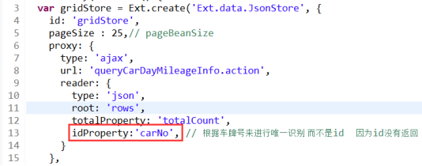

## 12.配置内网穿透(微信公众号的测试账号接口配置举例)

软件可使用ngrok或者natapp 这里使用的是ngrok
链接：https://www.ngrok.cc/_book/

## 12.1选择免费的


## 12.2填写配置

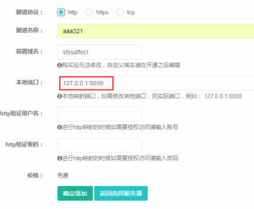

## 12.3输入注册后拿到的隧道id 启动内网穿透


## 13.linux搭建svn服务

链接：https://www.cnblogs.com/liuxianan/p/linux_install_svn_server.html


```shell
svnserve -d -r /home/svn（启动）
killall svnserve（停止）
```

