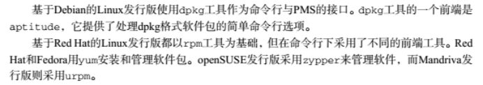
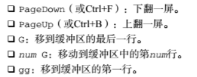
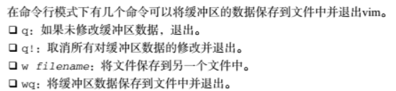

# 📅 201810 笔记

> 💡 2018年10月学习工作笔记 | 前端开发 | Linux 运维 | 问题排查

---

## 🗺️ 一、去除百度地图左下角的 Logo

### 解决方案

```css
/* 去除百度地图左下角的logo */
.anchorBL {
    display: none;
}
```

---

## 📦 二、YUM 卸载软件




---

## ✏️ 三、VI 编辑命令






---

## 📄 四、JS 读取本地的 JSON 文件

> ⚠️ **注意**：读取本地 JSON 文件，如果后续代码没有放在回调函数中，需要考虑同步异步问题。

### 1️⃣ 方法一：$.getJSON()

```javascript
$.getJSON(url, data, function(data) {
    // 处理数据
});
```


### 2️⃣ 方法二：$.ajax()

```javascript
$.ajax({
    url: url,
    data: data,
    success: callback,
    dataType: 'json'
});
```


---

## 🔤 五、前台传递过来的请求参数乱码

### 问题排查

检查 Ajax 的请求方式 GET 还是 POST，或者修改编解码。

> 💡 **解决方案**：
> - 一般来说传递中文用 POST
> - GET 传递中文需要在 JS 请求时先编码，到 POST 后台的时候再进行解码

---

## 📜 六、DIV 中 UL 上下滚动

投屏项目中的 table 滚动，仅能作为参考，具体还得根据实际业务修改。

参考链接：https://blog.csdn.net/u012365843/article/details/50429821

---

## 🔧 七、脚本必须项


### 配置要点

1. 配置 PATH 的环境变量
2. 文件开头需要写 `#!/bin/bash`