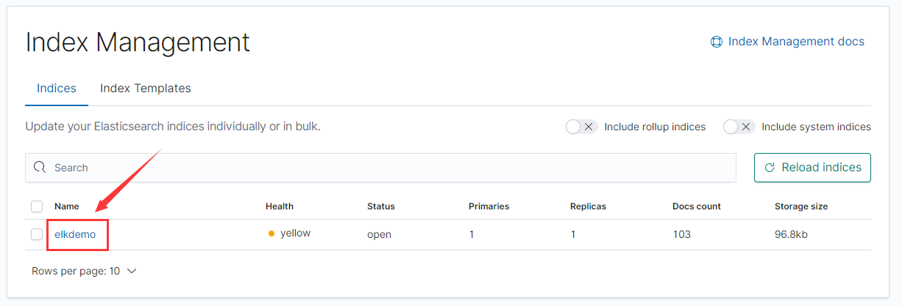
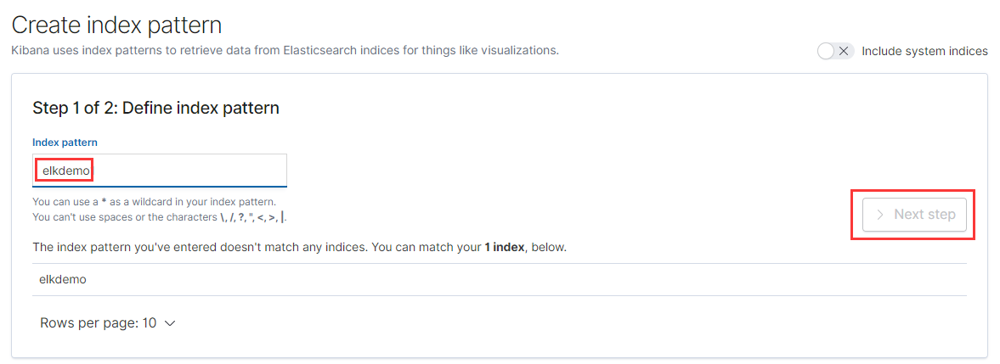
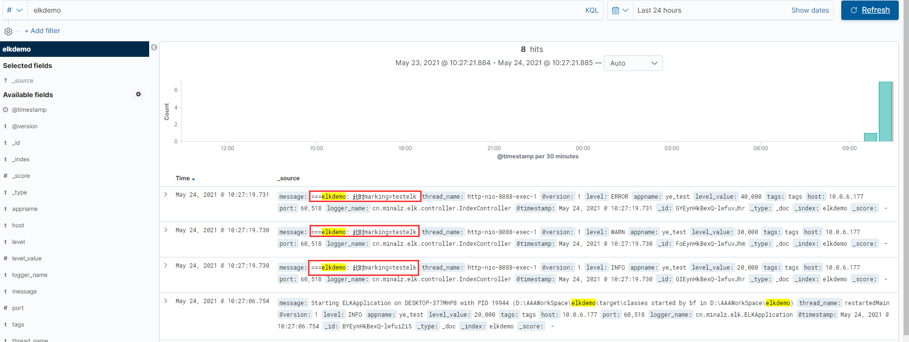

# SpringBoot项目集成ELK

## 1.新建springboot项目elkdemo

zip已上传

## 2.添加jar包

```
<!-- elk logstash -->
<dependency>
    <groupId>net.logstash.logback</groupId>
    <artifactId>logstash-logback-encoder</artifactId>
    <version>5.2</version>
</dependency>
```

## 3.添加logback.xml

destination 输入要发送到logstash的地址

```xml
<?xml version="1.0" encoding="UTF-8"?>
<!-- 日志级别从低到高分为TRACE < DEBUG < INFO < WARN < ERROR < FATAL，如果设置为WARN，则低于WARN的信息都不会输出 -->
<!-- scan:当此属性设置为true时，配置文件如果发生改变，将会被重新加载，默认值为true -->
<!-- scanPeriod:设置监测配置文件是否有修改的时间间隔，如果没有给出时间单位，默认单位是毫秒。当scan为true时，此属性生效。默认的时间间隔为1分钟。 -->
<!-- debug:当此属性设置为true时，将打印出logback内部日志信息，实时查看logback运行状态。默认值为false。 -->
<!--<configuration  scan="true" scanPeriod="10 seconds">-->
<configuration>

    <!--<include resource="org/springframework/boot/logging/logback/base.xml" />-->

    <contextName>logback</contextName>
    <!-- name的值是变量的名称，value的值是变量定义的值。通过定义的值会被插入到logger上下文中。定义变量后，可以使“${}”来使用变量。 -->
    <property name="log.path" value="log" />

    <!-- 彩色日志 -->
    <!-- 彩色日志依赖的渲染类 -->
    <conversionRule conversionWord="clr" converterClass="org.springframework.boot.logging.logback.ColorConverter" />
    <conversionRule conversionWord="wex" converterClass="org.springframework.boot.logging.logback.WhitespaceThrowableProxyConverter" />
    <conversionRule conversionWord="wEx" converterClass="org.springframework.boot.logging.logback.ExtendedWhitespaceThrowableProxyConverter" />
    <!-- 彩色日志格式 -->
    <property name="CONSOLE_LOG_PATTERN" value="${CONSOLE_LOG_PATTERN:-%clr(%d{yyyy-MM-dd HH:mm:ss.SSS}){faint} %clr(${LOG_LEVEL_PATTERN:-%5p}) %clr([%method,%line])  %clr(${PID:- }){magenta} %clr(---){faint} %clr([%thread]){faint} %clr(%-40.40logger{39}){cyan} %clr(:){faint} %msg%n${LOG_EXCEPTION_CONVERSION_WORD:-%wEx}}"/>

    <!--输出到控制台-->
    <appender name="CONSOLE" class="ch.qos.logback.core.ConsoleAppender">
        <!--此日志appender是为开发使用，只配置最低级别，控制台输出的日志级别是大于或等于此级别的日志信息-->
        <filter class="ch.qos.logback.classic.filter.ThresholdFilter">
            <level>info</level>
        </filter>
        <encoder>
            <Pattern>${CONSOLE_LOG_PATTERN}</Pattern>
            <!-- 设置字符集 -->
            <charset>UTF-8</charset>
        </encoder>
    </appender>

    <!--日志导出到 Logstash-->
    <appender name="stash"
              class="net.logstash.logback.appender.LogstashTcpSocketAppender">
        <destination>yourserverIP:9250</destination>
        <!-- encoder必须配置,有多种可选 -->
        <encoder charset="UTF-8"
                 class="net.logstash.logback.encoder.LogstashEncoder" >
            <!-- "appname":"ye_test" 的作用是指定创建索引的名字时用，并且在生成的文档中会多了这个字段  -->
            <customFields>{"appname":"ye_test"}</customFields>
        </encoder>
    </appender>

    <root level="INFO">
        <appender-ref ref="stash"/>
        <appender-ref ref="CONSOLE" />
    </root>

</configuration>
```

## 4.添加请求

```java
@Slf4j
@RestController
public class IndexController {
    private final Logger logger = LoggerFactory.getLogger(getClass());

    @GetMapping("/index")
    public Object index(String marking) {

        logger.debug("===elkdemo测试: 此时marking=" + marking);
        logger.info("===elkdemo: 此时marking" + marking);
        logger.warn("===elkdemo: 此时marking" + marking);
        logger.error("===elkdemo: 此时marking" + marking);

        return "success";
    }
}
```

## 5.启动项目

## 6.查看kibana看板

http://yourserverIP:5601/

点击Management->Elasticsearch->Index Management 会发现有一个索引



再点击Kibana->Index Patterns->Create index pattern->创建elkdemo->Next step



## 7.发送请求

http://localhost:8088/index?marking=testelk

点击Discover

