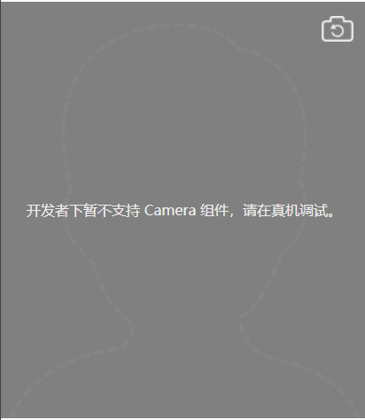

# 微信小程序自定义拍照

## 1. 微信小程序代码：

```html
<camera mode="normal" device-position="{{direction}}" flash="auto" binderror="error" class="info-camera">
  <cover-view class="controls">
    <cover-image src="../images/dash-people.png" style="width:100%; height:100%;"/>
  </cover-view>
  <cover-view class="noticeTXT">请在指定范围内拍照</cover-view>
  <cover-image class="info-swtich" src="../images/switch.png" bindtap="switchDirection" />
</camera>
<view class="info-button-view">
  <image class="info-image" src="{{src}}" mode="widthFix" bindtap="previewImage"></image>
  <button class="info-button" type="primary" bindtap="takePhoto" >拍照</button>
  <button class="info-button" type="primary" bindtap="backUp" >返回</button>
</view>
```

### 1.1 实现效果大概如下：




### 1.2 拍照代码：

```javascript
takePhoto() {
    const ctx = wx.createCameraContext()
    ctx.takePhoto({
      quality: 'high',
      success: (res) => {
        this.setData({
          src: res.tempImagePath
        });
      }
    })
  },
```

以上只是实现的方法，样式，图片就不贴了

参考链接：https://blog.csdn.net/u010606780/article/details/80887589

参考链接：https://blog.csdn.net/u011043997/article/details/85251571

tips：

+ 说个题外话，微信小程序的wx.request是没有cookie的，如果后台有用到session的技术就要注意啦，可能到时候各种取不到session中的，解决办法就是在登录的方法里，将返回结果中的session取出来当cookie给每个应用传到后台，就可以保证同一个cookie了

~~~javascript
var cookie = res.header["Set-Cookie"];
if (cookie != null && cookie != "") {
wx.setStorageSync("sessionid", res.header["Set-Cookie"]);
}
~~~

然后在wx.request中作为cookie参数传到后台去：

~~~javascript
header: {
    'cookie': wx.getStorageSync("sessionid")
},
~~~

+ tempImagePath是一个file://XXXXX.png 是一个本地图片，如果想要将图片上传到后台服务器，可以将之转为base64上传，后台同样可以成功转换

转换方法，微信已经提供了：

~~~javascript
wx.getFileSystemManager().readFileSync(this.data.src, "base64");
~~~

得到的结果是没有base64的head的

~~~javascript
data:image/png;base64,
~~~

直接就是我们想要的字符串，传到后台就能完成上传了

+ 由于这是自定义拍照，想要用自己的人脸接口，是这样规划的，但等到上线的时候，被拒了

原因如下：

~~~
1: 你好，小程序页面功能涉及：采集用户生物特征（人脸照片或视频）及其他敏感信息，用于身份认识或识别，为保障用户敏感隐私身份信息，平台暂不支持此功能。请去除相关功能后重新提交。
~~~

后面去官方文档查和开放社区查看，才知道原来人脸接口只能用腾讯自己的(而且账号需要上传文件进行审核验证才能用)，第三方是不支持的，所以业务规划到这里就GG了，有人建议加开关来控制这个相机，个人不建议这么做，因为应用总是用户来使用的，后面如果有一个用户反手点了个举报，那么该公司运营下的所有小程序都有可能会被封禁，导致影响其他业务，建议看看官方的规范文档，所以后面又采用H5来实现了

## 2. 转换为H5进行拍照

从小程序转到H5来实现自定义拍照功能了，我是怎么都无法实现相机框中加个人头定位框的，太难了，各种找啊，没法解决，看来更是没法采用自己的人脸接口来校验了，但是需求这么定的没办法啊，只能硬着头皮做，先把基础需求做出来再说吧，不然没法交差啊，那就开始吧

### 2.1 先调用手机摄像头

加这一句就可以调用摄像头了，这是H5自带的 主要在于accept="image/*" 加上这句 就是调用相机了

~~~html
<input class="info-img" type="file" name="" id="file" accept="image/*" capture="camera">
~~~

实现效果类型参照上面的图片是类似的

接着就是获取图片，然后转成base64传到后台去保存，用的formdata上传文件的方法

~~~javascript
//上传图片
function uploadImg(){
	var fileName = $("#file").val();
	// 获取文件后缀
    var d1=/\.[^\.]+$/.exec(fileName);
    if(d1==".png"){ // 校验是否是图片常规格式
    	var formData = new FormData();
    	formData.append("file", $('#file')[0].files[0]); 
    	$.ajax({
    		type: 'post',
    		url: "uploadImg.action",
    		data: formData,
    		cache: false,
    		processData: false,
    		contentType: false,
    		success:function(res){
                // 上传成功
            },
    		error:function(res){
                // 上传失败
    		}
    	});
    } else{
        // 请选择图片
    }
}
~~~

这下问题来了，有时能成功，有时又失败，ajax的方法是直接进去error里面的，然后换各种手机试，都是同样的情况

### 2.2 问题解决

然后就将file转成base64来上传，问题依旧，然后开始各种百度，说是tomcat的发送文件有大小限制，默认post是2M，需要加一个maxPostSize的配置，起码我配置了是没效果的，后面又想起来我是struts2，文件上传同样是有大小限制的，又加了一个配置

~~~xml
<constant name="struts.multipart.maxSize" value="20971520" /> <!-- 设置允许最大值 20MB(1024*1024*20) -->
~~~

还是出现同样的情况，时而成功，时而失败，到后台打了个debug，发现请求是进入后台了，我就等啊等，等了五分钟，表面看似失败的上传请求，居然会上传成功了，开始猜测可能是公司网络问题，用手机流量测，这里就搞笑了，我自己手机百试百灵，别人手机还是同样的情况，醉了，会不会是图片大小的问题呢？

开始获取各种手机拍出来的图片大小，图片大小居然在3M多，太费流量了吧，感觉很有可能就是图片过大的原因

我开始去试着压缩图片进行上传，用的canvas

参考链接：https://www.cnblogs.com/goloving/p/8260206.html

压缩的时候需要注意一点的是ios拍照会把图片横转过来，需要加兼容判断设备：

参考链接：https://www.jianshu.com/p/8afd55beca5a

文中用的是Blob，开始有点担心二进制大对象能不能成功上传到后台进行保存，确实没做过，后面试了一次，成功保存了，然后百度查了一下Blob的定义

~~~html
BLOB (binary large object),二进制大对象,是一个可以存储二进制文件的容器
~~~

这下放心了，开始各种手机拍照测试，终于成功了，而且上传速度很快，查了一下上传的图片大小，居然只有几十KB了，压缩了太多了，由此得出最终的结论就是，上传图片过大，网速过慢，导致后台接收的文件流过慢，甚至会中断，从而出现了会进error回调方法的情况


tips:

+ 第三方人脸检测接口应该是搞不定了，也不知道怎么去接入，可能后续会考虑离线检测吧
+ 拍照图片旋转问题，需要好好测试，这个参考链接我没具体测试，不知道会不会还有什么隐藏问题


