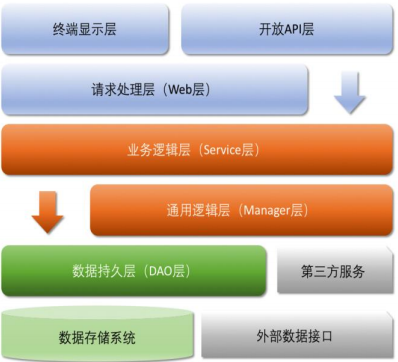

## 六、工程结构

应用分层

## 七、专有名词解释

1.POJO（Plain Ordinary Java Object）

: 在本规约中，POJO 专指只有 setter/getter/toString 的

简单类，包括 DO/DTO/BO/VO 等。

2.DO（Data Object）：阿里巴巴专指数据库表一一对应的 POJO 类。此对象与数据库表结构一

一对应，通过 DAO 层向上传输数据源对象。

3.DTO（Data Transfer Object）：数据传输对象，Service 或 Manager 向外传输的对象。

4.BO（Business Object）：业务对象，可以由 Service 层输出的封装业务逻辑的对象。

5.Query：数据查询对象，各层接收上层的查询请求。注意超过 2 个参数的查询封装，禁止使用

Map 类来传输。

6.VO（View Object）：显示层对象，通常是 Web 向模板渲染引擎层传输的对象。

7.AO（Application Object）

: 阿里巴巴专指 Application Object，即在 Service 层上，极为贴近

业务的复用代码。

8.CAS（Compare And Swap）：解决多线程并行情况下使用锁造成性能损耗的一种机制，这是

硬件实现的原子操作。CAS 操作包含三个操作数：内存位置、预期原值和新值。如果内存位

置的值与预期原值相匹配，那么处理器会自动将该位置值更新为新值。否则，处理器不做任何

操作。

9.GAV（GroupId、ArtifactId、Version）

: Maven 坐标，是用来唯一标识 jar 包。

10.OOP（Object Oriented Programming）

: 本文泛指类、对象的编程处理方式。

11.AQS（AbstractQueuedSynchronizer）

: 利用先进先出队列实现的底层同步工具类，它是很多上

层同步实现类的基础，比如：ReentrantLock、CountDownLatch、Semaphore 等，它们通

过继承 AQS 实现其模版方法，然后将 AQS 子类作为同步组件的内部类，通常命名为 Sync。

12.ORM（Object Relation Mapping）

: 对象关系映射，对象领域模型与底层数据之间的转换，本

文泛指 iBATIS, mybatis 等框架。

13.NPE（java.lang.NullPointerException）

: 空指针异常。

14.OOM（Out Of Memory）

: 源于 java.lang.OutOfMemoryError，当 JVM 没有足够的内存

来为对象分配空间并且垃圾回收器也无法回收空间时，系统出现的严重状况。

15.一方库: 本工程内部子项目模块依赖的库（jar 包）。

16.二方库: 公司内部发布到中央仓库，可供公司内部其它应用依赖的库（jar 包）。

17.三方库: 公司之外的开源库（jar 包）。