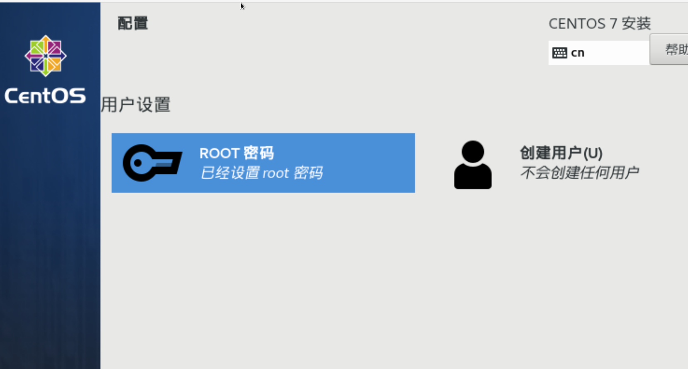

# VirtualBox 安装 centos7(Mac版)

转载链接地址: https://www.cnblogs.com/zhuzi91/p/12356856.html

## 1.准备条件

　　VirtualBox(6.1.4)、centos7 镜像(此文使用的是CentOS-7-x86_64-Minimal-1908.iso) 

　　本文是 Mac 环境下的安装.(之所以选择 6.1.4 版本的 VirtualBox,是因为低版本不兼容.这个会有一个问题,会在最后补充中说明)

　　1.1 VirtualBox 下载地址

　　　　https://www.virtualbox.org/wiki/Downloads

　　1.2 Centos 7 镜像下载地址()

　　　　http://isoredirect.centos.org/centos/7/isos/x86_64/

## 2安装

### 2.1 配置基本信息


　　

 　　

 

### 2.2 开始安装


  

 

 

 


这里可以设置 root 密码,也可以创建用户,根据自己需求.

 等待安装完成重启。

### 2.3 修改配置

```sh
##更新 如下两个文件的配置
/etc/sysconfig/network-scripts/ifcfg-enp0s3
/etc/sysconfig/network-scripts/ifcfg-enp0s8
onboot=yes

##然后重启网络
servcie network restart
```

## 3、更改 yum 的配置

### 3.1 下载阿里云的repo

```sh
[root@k8s-master ~]# yum install -y wget  
[root@centos7 /]# mv /etc/yum.repos.d/CentOS-Base.repo /etc/yum.repos.d/CentOS-Base.repo.bak
[root@centos7 /]# wget -O /etc/yum.repos.d/CentOS-Base.repo http://mirrors.aliyun.com/repo/Centos-7.repo
```

### 3.2 清除缓存并生成新的缓存

```sh
[root@centos7 /]# yum clean all
[root@centos7 /]# yum makecache
```

 

### 3.3 验证

安装net-tools工具，运行ifconfig命令

```sh
yum install -y net-tools
```


### 3.4. 关闭防火墙

```sh
[root@k8s-master ~]# firewall-cmd --state
running
[root@k8s-master ~]# systemctl stop firewalld.service
[root@k8s-master ~]# systemctl disable firewalld.service
Removed symlink /etc/systemd/system/multi-user.target.wants/firewalld.service.
Removed symlink /etc/systemd/system/dbus-org.fedoraproject.FirewallD1.service.

firewall-cmd --state #查看防火墙状态

systemctl stop firewalld.service #停止firewall
systemctl disable firewalld.service #禁止firewall开机启动
```

### 3.5. 关闭selinux

```sh
[root@k8s-master ~]# getenforce
Enforcing
[root@k8s-master ~]# setenforce 0
[root@k8s-master ~]# sed -i 's/^ *SELINUX=enforcing/SELINUX=disabled/g' /etc/selinux/config

#查看selinux状态
getenforce

#临时关闭selinux
setenforce 0 
#永久关闭（需重启系统）
sed -i 's/^ *SELINUX=enforcing/SELINUX=disabled/g' /etc/selinux/config 
至此完成Centos7.6操作系统安装和优化。
```

## 4.补充

## 4.1 Mac 的 VirtulBox6.X 版本的 host-only 配置没有了,怎么配置?

　　现在需要这么来设置: 

　　

 

以下是非转载的

## 4.2 Mac启动报错

```sh
# 添加网卡报错：
error：VBoxNetAdpCtl: Error while adding new interface: failed to open /dev/vboxnetctl: No such file or directory.
```

```sh
# 终端运行：
sudo /Library/Application\ Support/VirtualBox/LaunchDaemons/VirtualBoxStartup.sh restart
```

## 5.虚拟机克隆

### 5.1 相同的虚拟机克隆后,IP地址没有变化,需要进行修改,修改only-host的那个网卡信息

```sh
vi /etc/sysconfig/network-scripts/ifcfg-enp0s3
# 修改 
BOOTPROTO="dhcp" -> BOOTPROTO="static"
IPADDR="192.168.56.101" -> IPADDR="192.168.56.102"
# 保存 
wq
# 重启网卡
service network restart
# 查看网卡信息,IP变了
```

### 5.2 克隆的Linux系统中重启网卡失败“Bringing up interface eth0: Device eth0 does not seem to be present“

参考链接: https://blog.csdn.net/cnds123321/article/details/116356027

```
注：系统版本CentOS6.3
执行echo "" > /etc/udev/rules.d/70-persistent-net.rules命令将该文件清空
接着cp /etc/udev/rules.d/70-persistent-net.rules /etc/udev/rules.d/70-persistent-net.rules.bak备份该文件，防止后面出错不能还原。
然后执行rm -rf /etc/udev/rules.d/70-persistent-net.rules删除该文件
再执行vi /etc/sysconfig/network-scripts/ifcfg-eth0命令打开文件，并删除UUID和HWADDR这两行
保存该文件并退出，执行reboot命令，重启系统
再次重启网卡服务service network restart命令就可以启动成功了
最后输入ipconfig命令查看IP地址成功
```

